# Mini Container Runtime

## 1. Team Information

* Team Member: **Shreesh Athreya**
* SRN: **PES1UG24CS441**

---

## 2. Build, Load, and Run Instructions

### Environment

* Developed and tested on **Ubuntu (VM)**
* Requires **root privileges** for:

  * namespace creation
  * `chroot`
  * kernel module operations

---

### Build

From the `boilerplate` directory:

```bash
make
```

---

### Start Supervisor

```bash
sudo ./engine supervisor
```

* This runs a **long-lived supervisor process**
* Handles all container lifecycle operations

---

### Start Container

```bash
sudo ./engine start alpha ../rootfs-alpha /bin/ls
```

---

### Start Multiple Containers

```bash
sudo ./engine start alpha ../rootfs-alpha /bin/ls
sudo ./engine start beta ../rootfs-beta /bin/ls
```

---

### List Running Containers

```bash
sudo ./engine ps
```

---

### Stop Containers

```bash
sudo ./engine stop alpha
sudo ./engine stop beta
```

---

### Logging Output

```bash
cat /tmp/container.log
```

---

### Load Kernel Module

```bash
sudo insmod monitor.ko
```

---

### View Kernel Logs

```bash
sudo dmesg | grep container_monitor
```

---

### Remove Kernel Module

```bash
sudo rmmod monitor
```

---

## 3. Demo with Screenshots

### Screenshot 1 — Container Execution

Single container execution using `/bin/ls`.

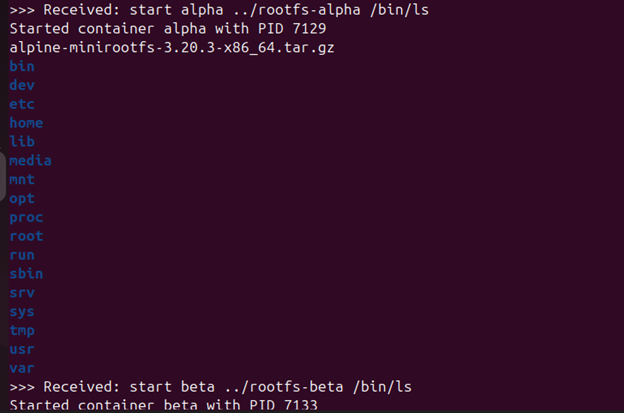

---

### Screenshot 2 — Multi-Container Execution

Two containers (`alpha`, `beta`) running simultaneously.

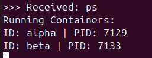

---

### Screenshot 3 — Logging System

Container output captured using producer-consumer logging and stored in `/tmp/container.log`.

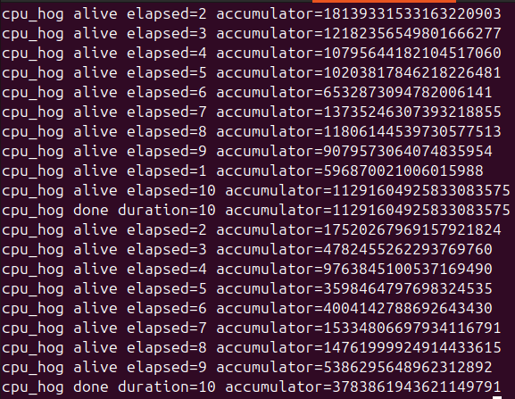

---

### Screenshot 4 — Supervisor Interaction

Supervisor receiving commands and managing containers.

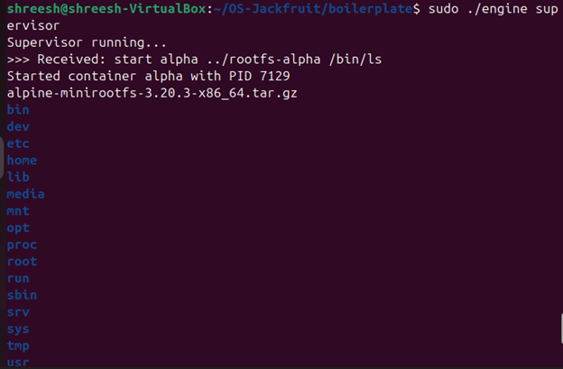

---

### Screenshot 5 — Soft Limit

Kernel logs showing soft memory limit warning.

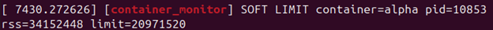

---

### Screenshot 6 — Hard Limit

Kernel logs showing process termination after exceeding hard limit.

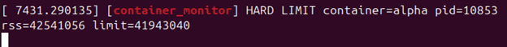

---

### Screenshot 7A — Scheduling Before

CPU usage before changing process priority.

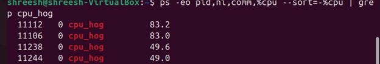

---

### Screenshot 7B — Scheduling After

CPU distribution changes after applying `renice`.

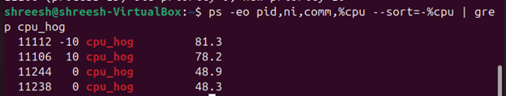

---

### Screenshot 8A — Cleanup Commands

Stopping containers and unloading module.

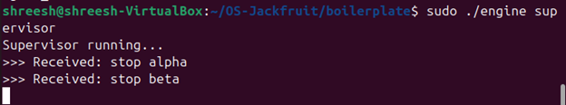

---

### Screenshot 8B — Cleanup Output

Supervisor confirming container termination.

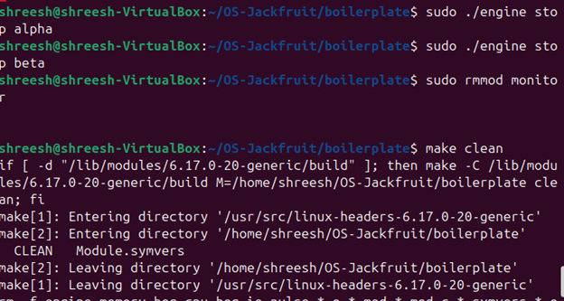

---

### Screenshot 9 — Kernel Logs

Kernel module activity including container registration and limit events.

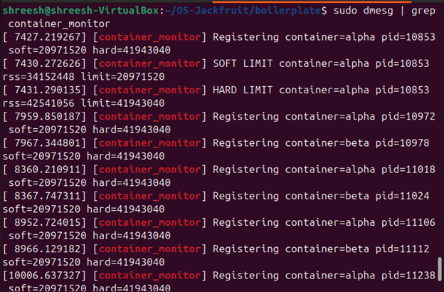

---

## 4. Engineering Analysis

### Container Isolation

Containers are created using `clone()` with:

* `CLONE_NEWPID` → separate process IDs
* `CLONE_NEWNS` → separate mount namespace
* `CLONE_NEWUTS` → separate hostname

Each container:

* enters a new filesystem using `chroot()`
* runs in an isolated environment
* mounts its own `/proc`

---

### Supervisor Architecture

* A single **supervisor process** manages all containers
* Uses **FIFO (named pipe)** for communication
* Supports commands:

  * start
  * stop
  * ps

This avoids duplicated state and ensures centralized control.

---

### Logging System

* Uses **producer-consumer model**
* Producer:

  * reads container output
* Consumer:

  * writes to `/tmp/container.log`

Synchronization handled using:

* mutex
* condition variables

---

### Kernel Module (Memory Monitoring)

* Tracks **RSS (Resident Set Size)** of processes
* Implements:

  * **Soft limit** → warning in logs
  * **Hard limit** → kills process

Kernel logs visible using:

```bash
dmesg
```

---

### Scheduling Behavior

* CPU-bound workload generated using `cpu_hog`
* Process priority adjusted using:

```bash
renice
```

Observation:

* Lower nice value → higher CPU share
* Higher nice value → lower CPU share

---

## 5. Design Decisions and Tradeoffs

### Use of `chroot`

* Simpler than `pivot_root`
* Provides sufficient filesystem isolation
* Tradeoff: weaker than full container isolation

---

### Supervisor Model

* Single controller process
* Easier state management
* Tradeoff: requires IPC handling

---

### Logging Design

* Producer-consumer ensures:

  * no blocking
  * efficient logging

Tradeoff:

* added synchronization complexity

---

### Kernel Monitoring

* Implemented in kernel space for accuracy
* Uses periodic checks

Tradeoff:

* not real-time exact measurement

---

## 6. Challenges Faced

* Debugging FIFO communication issues
* Handling kernel module compilation errors
* Ensuring compatibility with Linux kernel version
* Managing multiple processes safely
* Avoiding zombie processes

---

## 7. Conclusion

This project demonstrates key Operating Systems concepts:

* Process isolation
* Inter-process communication
* Kernel-user interaction
* Memory management
* CPU scheduling

It provides practical experience in building a lightweight container runtime similar to real-world systems.

---
